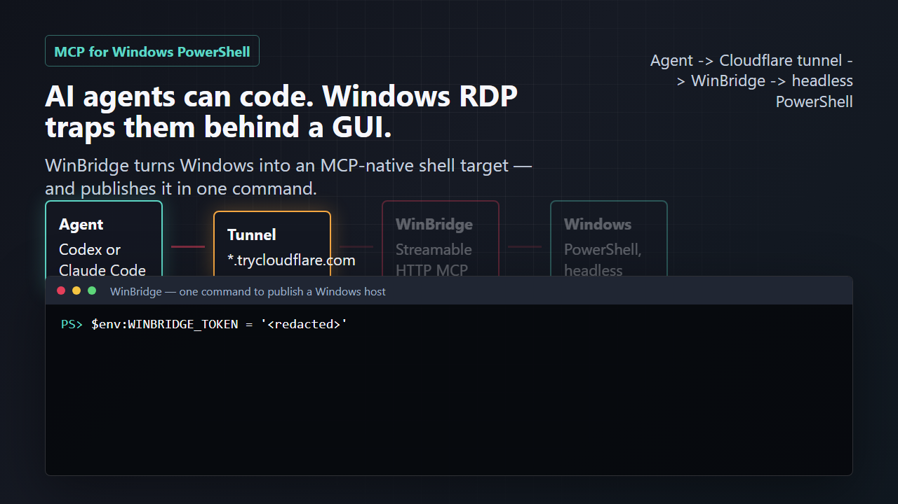

# WinBridge MCP

[](https://github.com/GhouI/winbridge-mcp/actions/workflows/ci.yml)
[](LICENSE)
[](https://modelcontextprotocol.io)
[](https://learn.microsoft.com/powershell/)

**AI agents can write code, run terminals, and use tools. Windows RDP still traps them behind a GUI. WinBridge turns a Windows host into an MCP-native PowerShell target — and can publish it to your agent with a single command.**

WinBridge is a TypeScript [Model Context Protocol](https://modelcontextprotocol.io) server that runs on a Windows machine and exposes PowerShell tools over Streamable HTTP. It lets Codex, Claude Code, and other MCP-capable agents operate a Windows host without RDP screenshots, mouse control, or a human-owned terminal window.

```text
Agent or MCP client  ->  WinBridge MCP over HTTP  ->  Windows PowerShell
```

> Renamed from **Pendragon MCP**. Legacy `PENDRAGON_*` environment variables still work as aliases — see [Configuration](#configuration).

## Demo

[](assets/winbridge-demo.mp4)

Watch the generated demo video: [assets/winbridge-demo.mp4](assets/winbridge-demo.mp4)

The demo is rendered with [Remotion](https://www.remotion.dev/) from the source in [video/](video/). Re-render it locally with:

```powershell
npm run video:render
```

## Why WinBridge?

Most coding agents are comfortable in terminals, but Windows RDP is a GUI-first environment. WinBridge gives agents a clean command surface instead:

- Run PowerShell commands on a Windows host from any MCP client.
- Keep persistent PowerShell sessions when variables, cwd, or imported modules matter.
- Publish the server to your agent in one command with a built-in Cloudflare tunnel — no fixed public IP, no inbound firewall hole.
- Use bearer-token auth and provider firewalls instead of exposing raw RDP workflows.
- Test locally with a diagnostic client before connecting a real agent.
- Avoid IIS: WinBridge is a standalone Node HTTP server.

## Tooling

WinBridge exposes up to eight MCP tools (the last three are opt-in):

| Tool | Purpose |
| --- | --- |
| `powershell_execute` | Run one isolated PowerShell command. |
| `powershell_open_session` | Start a persistent PowerShell session. |
| `powershell_send` | Send a command to a persistent session. |
| `powershell_close_session` | Close a persistent session. |
| `powershell_list_sessions` | List active sessions. |
| `take_screenshot` | Capture the current screen of the Windows host as an image. Off by default (see below). |
| `file_upload` | Write a file to the host, inside the configured file root. Off by default (see below). |
| `file_download` | Read a file from the host (optionally moving it) as base64. Off by default (see below). |

Command results include:

```json
{
  "commandId": "uuid",
  "stdout": "hello\r\n",
  "stderr": "",
  "exitCode": 0,
  "durationMs": 143,
  "truncated": false
}
```

`take_screenshot` captures the full virtual desktop (all monitors) and returns an
MCP image block (base64 PNG by default, `jpeg` optional) alongside a metadata
block:

```json
{
  "commandId": "uuid",
  "success": true,
  "format": "png",
  "mimeType": "image/png",
  "width": 1920,
  "height": 1080,
  "bytes": 82344,
  "durationMs": 96
}
```

Screen capture needs an active interactive desktop session. If WinBridge runs in
a non-interactive service context (Windows session 0), the capture fails and the
tool returns `success: false` with the PowerShell error instead of an image.

Because screen capture reads whatever is on the desktop, it is a
read/exfiltration capability the command policy cannot express, so it is
**disabled by default**. Enable it with `WINBRIDGE_ALLOW_SCREENSHOT=1`, and
optionally restrict it to specific principal roles with `WINBRIDGE_SCREENSHOT_ROLES`.
When disabled (or when the caller's role is not permitted) the tool is not
exposed to that principal at all. Captures are written to a **server-owned**
directory (`WINBRIDGE_SCREENSHOT_DIR`) — callers cannot choose the path — and are
automatically deleted after `WINBRIDGE_SCREENSHOT_RETENTION_HOURS` (default `8`)
so they do not accumulate on the host.

### File transfer

`file_upload` and `file_download` move files between the agent and the Windows
host over MCP (base64-encoded, SHA-256 returned for integrity). They are **off by
default** and only registered once you set a sandbox root:

```powershell
$env:WINBRIDGE_FILE_ROOT = "C:\winbridge-files"
```

- **Every path is relative to `WINBRIDGE_FILE_ROOT`.** Absolute paths, `..`
  traversal, and symlinks that escape the root are rejected, so a transfer can
  never touch files outside the sandbox. Setting the root is what enables the
  tools.
- `file_upload` refuses to overwrite unless `overwrite: true`, and creates
  parent directories inside the root as needed.
- `file_download` returns the file as base64; set `deleteSource: true` to **move**
  it (the server copy is deleted after a successful read).
- Files larger than `WINBRIDGE_MAX_FILE_BYTES` (default 75 MB) are rejected in
  either direction.
- Every transfer is written to the audit log (tool, principal, server path, size).

## Quickstart

Requirements:

- Node.js 24 or newer
- npm
- Windows PowerShell (`powershell.exe`) or PowerShell 7 (`pwsh`)

Run WinBridge locally:

```powershell
git clone https://github.com/GhouI/winbridge-mcp.git
cd winbridge-mcp
npm install
$env:WINBRIDGE_TOKEN = "dev-token"
npm run dev
```

The server defaults to:

```text
http://127.0.0.1:7573/mcp
```

Use the diagnostic client from another terminal:

```powershell
$env:WINBRIDGE_TOKEN = "dev-token"
npm run client -- list-tools
npm run client -- exec Write-Output hello
```

Target more than one WinBridge server with `WINBRIDGE_URLS`:

```powershell
$env:WINBRIDGE_TOKEN = "shared-token"
$env:WINBRIDGE_URLS = "http://win-1:7573/mcp,http://win-2:7573/mcp"
npm run client -- exec hostname
```

## Public Access With One Command

When you set up WinBridge on a server and want an agent to reach it from anywhere, enable the built-in [Cloudflare quick tunnel](https://developers.cloudflare.com/cloudflare-one/connections/connect-networks/do-more-with-tunnels/trycloudflare/). WinBridge downloads `cloudflared` on first use (no Cloudflare account needed), opens a tunnel, and prints a ready-to-paste agent config.

```powershell
$env:WINBRIDGE_TOKEN = "replace-with-a-long-random-token"
$env:WINBRIDGE_TUNNEL = "cloudflare"
npm run dev
```

Output:

```text
WinBridge MCP listening at http://127.0.0.1:7573/mcp
Cloudflare tunnel ready: https://random-words.trycloudflare.com
Public MCP endpoint: https://random-words.trycloudflare.com/mcp

Connect an agent with this public endpoint (the bearer token is still required):

Claude Code:
  claude mcp add --transport http winbridge https://random-words.trycloudflare.com/mcp --header "Authorization: Bearer <WINBRIDGE_TOKEN>"
...
```

You can also enable it ad hoc with a flag:

```powershell
npm run dev -- --tunnel
```

Notes:

- `cloudflared` connects to WinBridge over loopback, so tunnel mode needs **no** `0.0.0.0` bind and **no** inbound firewall rule. WinBridge tells `cloudflared` to rewrite the forwarded `Host` header to `127.0.0.1` so the server's built-in DNS-rebinding protection keeps working.
- Tunnel mode publishes a remote-command server to the public internet, protected **only** by the bearer token. Use a long random `WINBRIDGE_TOKEN` (32+ characters); WinBridge warns at startup if the token looks weak.
- Quick-tunnel hostnames are random and **change every restart**. Re-paste the printed URL into your agent, or move to a [named Cloudflare tunnel](https://developers.cloudflare.com/cloudflare-one/connections/connect-networks/) for a stable hostname.
- The bearer token is still enforced over the tunnel. Treat the public URL as sensitive and rotate the token after demos.
- Auto-install downloads and runs the official `cloudflared` binary from GitHub releases over HTTPS. If you need a verified/pinned binary, set `WINBRIDGE_TUNNEL_AUTOINSTALL=0` and point `WINBRIDGE_CLOUDFLARED_PATH` at a `cloudflared` you installed and checked yourself.

## Connect Agents

Full setup guide: [Install WinBridge and Connect Agents](docs/INSTALL_AND_AGENT_USAGE.md)

Feature overview: [WinBridge Features](docs/FEATURES.md)

Codex `~/.codex/config.toml`:

```toml
[mcp_servers.winbridge]
url = "http://WINDOWS_SERVER_IP:7573/mcp"
bearer_token_env_var = "WINBRIDGE_TOKEN"
tool_timeout_sec = 120
default_tools_approval_mode = "prompt"
enabled = true
```

Claude Code:

```powershell
claude mcp add --transport http winbridge http://WINDOWS_SERVER_IP:7573/mcp `
  --header "Authorization: Bearer YOUR_TOKEN"
```

Also see:

- [Codex config example](examples/codex-config.toml)
- [Claude Code MCP JSON example](examples/claude.mcp.json)

## Remote Windows Deployment

On the Windows host:

```powershell
git clone https://github.com/GhouI/winbridge-mcp.git
cd winbridge-mcp
npm install
$env:WINBRIDGE_TOKEN = "replace-with-a-long-random-token"
$env:WINBRIDGE_HOST = "0.0.0.0"
$env:WINBRIDGE_PORT = "7573"
npm run dev
```

Open the Windows firewall for the MCP port:

```powershell
New-NetFirewallRule `
  -DisplayName "WinBridge MCP 7573" `
  -Direction Inbound `
  -Protocol TCP `
  -LocalPort 7573 `
  -Action Allow
```

Restrict your cloud firewall so TCP `7573` is reachable only from trusted IP addresses. If you only need agent access (not raw port access), prefer [tunnel mode](#public-access-with-one-command) and keep the bind on `127.0.0.1`.

## Configuration

Prefer a UI? The [`setup-web`](setup-web/) app (Next.js) generates the env vars,
a `start.ps1`, a Windows firewall rule for your allowed IPs, and agent-connect
snippets from a form — see [setup-web/README.md](setup-web/README.md).

WinBridge reads `WINBRIDGE_*` variables. The legacy `PENDRAGON_*` names are still accepted as aliases; `WINBRIDGE_*` wins when both are set.

| Variable | Default | Description |
| --- | --- | --- |
| `WINBRIDGE_TOKEN` | required* | Bearer token for a single full-access admin. *Required unless `WINBRIDGE_PRINCIPALS` is set. |
| `WINBRIDGE_PRINCIPALS` | empty | JSON array of per-user principals: `[{"name","role","token"\|"tokenEnv","allow":[],"deny":[],"tools":[]}]`. Enables per-user authorization. `tools` optionally limits a principal to specific tool names (omit for all). |
| `WINBRIDGE_COMMAND_ALLOWLIST` | empty | Regex allowlist (comma-separated or JSON array). If non-empty, only matching commands run. |
| `WINBRIDGE_COMMAND_DENYLIST` | empty | Regex denylist (comma-separated or JSON array). Matching commands are blocked; deny wins over allow. |
| `WINBRIDGE_AUDIT_LOG` | empty | Path to an append-only JSONL audit log of every tool call. |
| `WINBRIDGE_TLS_CERT` | empty | PEM certificate path. Set with `WINBRIDGE_TLS_KEY` to serve HTTPS in-app. |
| `WINBRIDGE_TLS_KEY` | empty | PEM private key path for TLS. |
| `WINBRIDGE_TLS_KEY_PASSPHRASE` | empty | Passphrase for an encrypted TLS key. |
| `WINBRIDGE_TLS_CLIENT_CA` | empty | PEM CA bundle to verify client certificates. Enables mutual TLS (requires TLS). |
| `WINBRIDGE_ALLOW_SCREENSHOT` | `0` | Set to `1` to enable the `take_screenshot` tool. Disabled by default. |
| `WINBRIDGE_SCREENSHOT_ROLES` | empty | Comma-separated principal roles allowed to capture. Empty means any authenticated principal (when enabled). |
| `WINBRIDGE_SCREENSHOT_DIR` | temp subdir | Server-owned directory captures are written to. Callers cannot override it. |
| `WINBRIDGE_SCREENSHOT_RETENTION_HOURS` | `8` | Captures older than this are deleted (on startup and before each capture). Set `0` to keep them indefinitely. |
| `WINBRIDGE_FILE_ROOT` | empty | Sandbox root for `file_upload`/`file_download`. Setting it enables the tools; all transfer paths resolve within it. |
| `WINBRIDGE_MAX_FILE_BYTES` | `78643200` | Maximum bytes per transferred file (both directions). Default 75 MB. |
| `WINBRIDGE_URL` | `http://127.0.0.1:7573/mcp` | Diagnostic client URL for one WinBridge server. |
| `WINBRIDGE_URLS` | empty | Diagnostic client comma-separated URLs for multiple servers using `WINBRIDGE_TOKEN`. |
| `WINBRIDGE_TARGETS` | empty | Diagnostic client JSON array for named servers and per-target token env vars. |
| `WINBRIDGE_HOST` | `127.0.0.1` | Bind host. Use `0.0.0.0` only behind a firewall or tunnel. |
| `WINBRIDGE_PORT` | `7573` | Bind port. |
| `WINBRIDGE_ENDPOINT_PATH` | `/mcp` | MCP endpoint path. |
| `WINBRIDGE_ALLOWED_ORIGINS` | empty | Comma-separated allowed `Origin` values. |
| `WINBRIDGE_SHELL_PATH` | auto | Explicit `pwsh` or `powershell.exe` path. |
| `WINBRIDGE_CWD` | process cwd | Default working directory. |
| `WINBRIDGE_TIMEOUT_MS` | `30000` | Default command timeout. |
| `WINBRIDGE_MAX_OUTPUT_BYTES` | `1048576` | Max captured bytes per output stream. |
| `WINBRIDGE_TUNNEL` | empty | Set to `cloudflare` to publish the server through a Cloudflare quick tunnel. |
| `WINBRIDGE_TUNNEL_AUTOINSTALL` | `1` | Auto-download `cloudflared` when missing. Set to `0` to require a preinstalled binary. |
| `WINBRIDGE_CLOUDFLARED_PATH` | auto | Explicit path to the `cloudflared` binary. |

## Security

WinBridge is a remote command-execution server. Treat it as sensitive infrastructure.

- Use a long random `WINBRIDGE_TOKEN`.
- Keep `WINBRIDGE_HOST=127.0.0.1` unless you have a trusted network path or are using tunnel mode.
- Do not expose WinBridge directly to the public internet on a raw port.
- Restrict TCP `7573` at your provider firewall.
- Tunnel URLs are still protected by the bearer token, but treat them as secrets and rotate after demos.
- Run as a dedicated low-privilege Windows user when possible.
- Rotate tokens after demos, testing sessions, and shared access.

### Hardening

WinBridge can now enforce transport security, per-user authorization, command policy, and auditing without an external proxy.

**Serve HTTPS in-app (optionally with mutual TLS):**

```powershell
$env:WINBRIDGE_TOKEN = "replace-with-a-long-random-token"
$env:WINBRIDGE_TLS_CERT = "C:\certs\winbridge-cert.pem"
$env:WINBRIDGE_TLS_KEY  = "C:\certs\winbridge-key.pem"
# Require client certificates (mTLS): connections without a cert signed by this CA
# are dropped during the TLS handshake, before the bearer-token check.
$env:WINBRIDGE_TLS_CLIENT_CA = "C:\certs\client-ca.pem"
npm run dev
```

**Give each client its own identity, role, and command policy:**

```powershell
$env:WINBRIDGE_PRINCIPALS = @'
[
  { "name": "ci",    "role": "admin",    "tokenEnv": "CI_TOKEN" },
  { "name": "agent", "role": "readonly", "tokenEnv": "AGENT_TOKEN",
    "allow": ["^Get-", "^Test-"], "deny": ["Remove-Item", "Stop-Service"],
    "tools": ["powershell_execute"] }
]
'@
```

**Apply a deployment-wide guardrail and record everything:**

```powershell
$env:WINBRIDGE_COMMAND_DENYLIST = "Remove-Item -Recurse,Format-Volume,Stop-Computer"
$env:WINBRIDGE_AUDIT_LOG = "C:\logs\winbridge-audit.jsonl"
```

The global policy plus the caller's principal policy must both allow a command; deny always wins, and a non-empty allowlist blocks anything it does not match. Blocked calls return an MCP error and are written to the audit log.

**Install as a Windows service under a dedicated account:**

```powershell
npm run build
$pw = Read-Host -AsSecureString "Service account password"
./scripts/install-service.ps1 -EnvFile .env -ServiceAccount ".\winbridge" -ServiceAccountPassword $pw
# Remove later with: ./scripts/uninstall-service.ps1
```

See [SECURITY.md](SECURITY.md) for the full control matrix and what remains out of scope.

## Roadmap

Shipped: in-app HTTPS/mTLS, per-client authorization, command allow/deny policy, audit logging, and a Windows service installer (see [Hardening](#hardening)).

Still planned:

- Named Cloudflare tunnels for stable hostnames
- Request-level Windows Integrated Authentication (Negotiate/NTLM)
- Rate limiting and per-principal quotas
- Git Bash support
- Packaged releases

## Contributing

Issues, ideas, and pull requests are welcome. Start with [CONTRIBUTING.md](CONTRIBUTING.md).

## License

MIT. See [LICENSE](LICENSE).
